# MarlinSpike

MarlinSpike is a passive OT/ICS network topology mapper. It analyzes PCAP and PCAPNG captures, builds a topology graph, infers Purdue levels, fingerprints vendors, and scores the resulting environment for risk indicators such as cross-zone communication, cleartext services, beaconing, and DNS exfiltration.

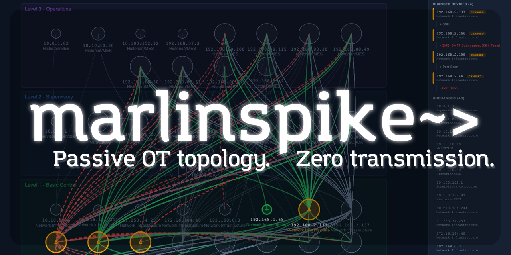

**1.1M packets -> 46 nodes, 1,344 edges, 432 findings in 29 seconds.**

Repository: [github.com/riverrisk/marlinspike](https://github.com/riverrisk/marlinspike)

## Highlights

- Passive analysis only: no active scanning or packet transmission
- OT protocol parsing for Modbus, EtherNet/IP, S7, DNP3, PROFINET, OPC UA, BACnet, and more
- Topology construction with Purdue-level inference and vendor fingerprinting
- Risk surfacing for remote access exposure, C2-like beaconing, DNS entropy anomalies, and policy violations
- Flask web UI with project management, report viewer, diff viewer, asset inventory, scan history, and optional local live capture mode
- Docker Compose deployment with PostgreSQL backing the application

## Feature Overview

MarlinSpike is designed to turn raw packet captures into a workflow an OT operator, asset owner, or security analyst can actually use.

1. Report result view with traffic analysis, assessment reporting, and inventory summary
2. Relationship map and live topology visualization
3. Detailed asset inventory with per-asset conversation details
4. Detailed conversation analysis with C2 and beaconing detection surfaced in the report data
5. Ad hoc scan execution from the web UI
6. Multi-capture scanning support, including large-PCAP processing with chunking and streaming progress
7. Audit logging and historical tracking of completed scans
8. Multi-project organization for separating captures and reports
9. Multi-user support with admin controls
10. System health and monitoring views for the running deployment
11. Report-to-report diff viewing for topology change comparison

## Export Support

The report workflow supports export directly from the UI:

- Print or save to PDF from the report viewer
- PNG export from the topology viewer
- CSV export from the asset inventory view

## Additional Capabilities

- Report-to-report diffing with added, removed, changed, and unchanged topology comparison
- Live topology viewing during active scans
- Scan-stage progress streaming with ingest, analyze, classify, and report state visibility
- Per-user administration controls including password resets and upload limits
- Multi-report lifecycle actions including view, download, delete, and compare
- Retry of failed or interrupted scans from scan history
- Sample library administration with category management and PCAP upload/delete controls
- Capture filter input and ephemeral-port suppression controls in the scan workflow
- MAC table reporting alongside the main assessment view

## Screenshots

### 1. Relationship map and topology viewer

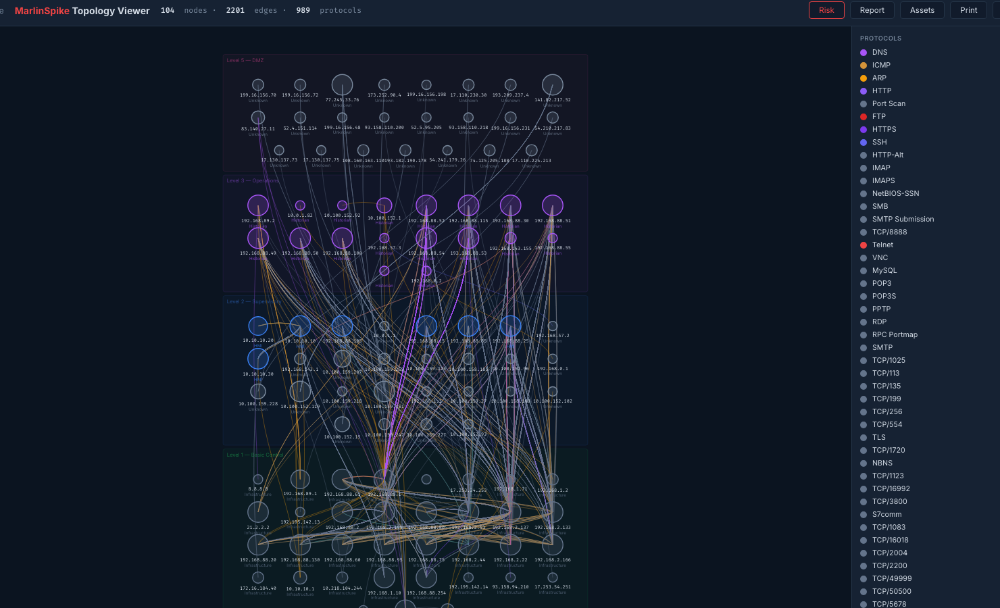

### 2. Report result with assessment summary and inventory context

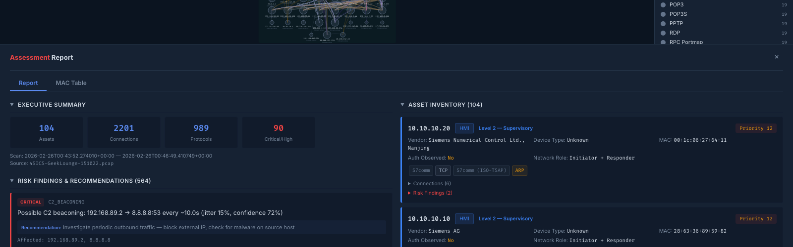

### 3. Detailed asset inventory

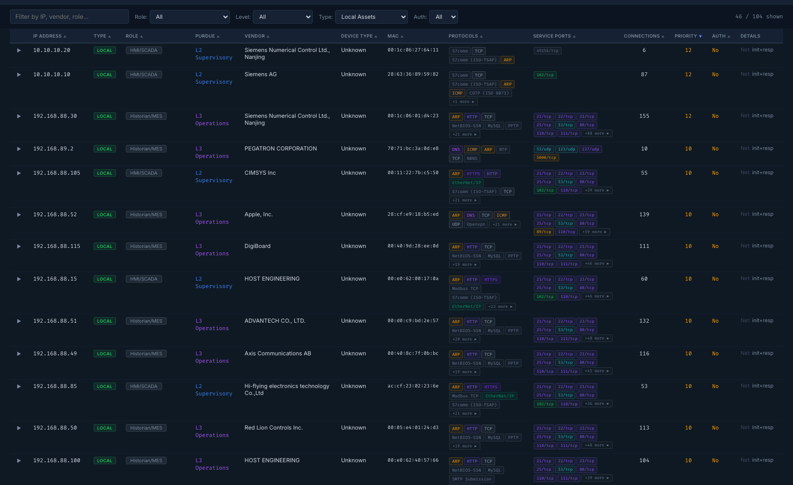

### 4. Expanded conversation analysis and risk findings

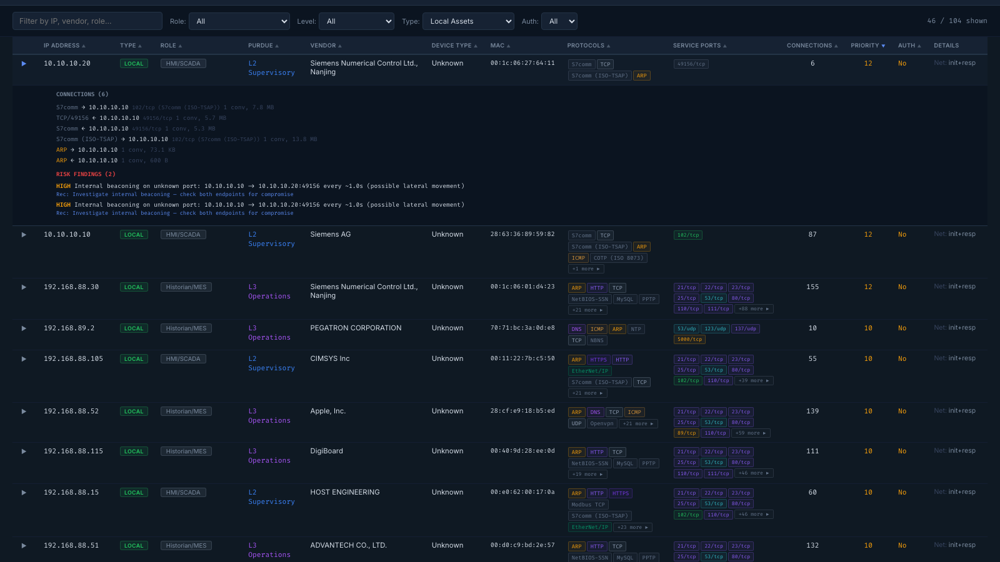

### 5. Ad hoc scan execution

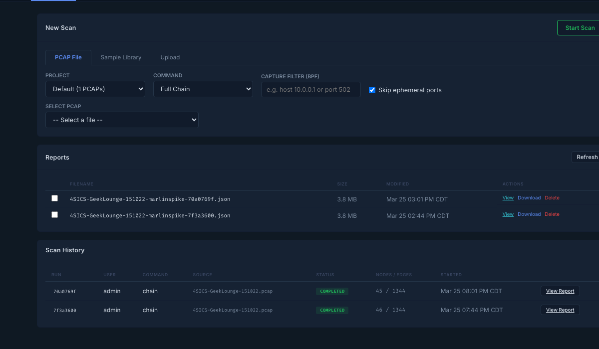

### 6. Large-PCAP processing with chunking and streaming progress

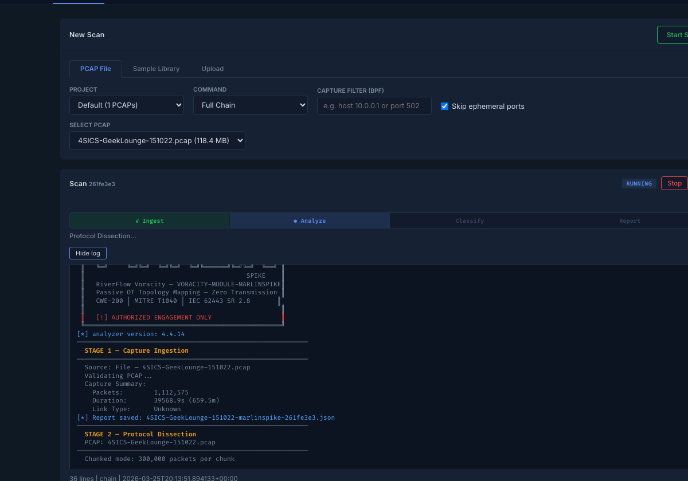

### 7. Scan history and audit trail

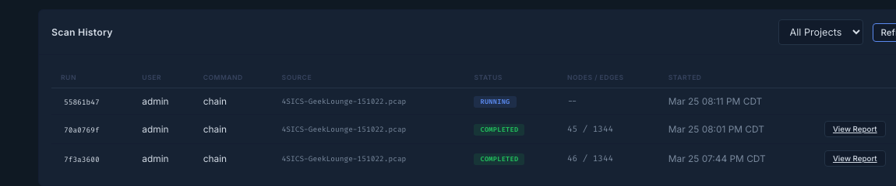

### 8. Multi-project workflow

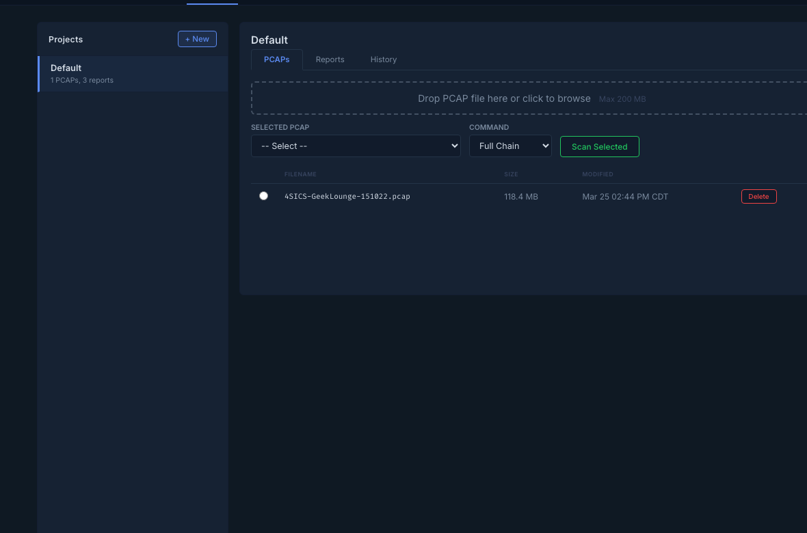

### 9. Multi-user administration

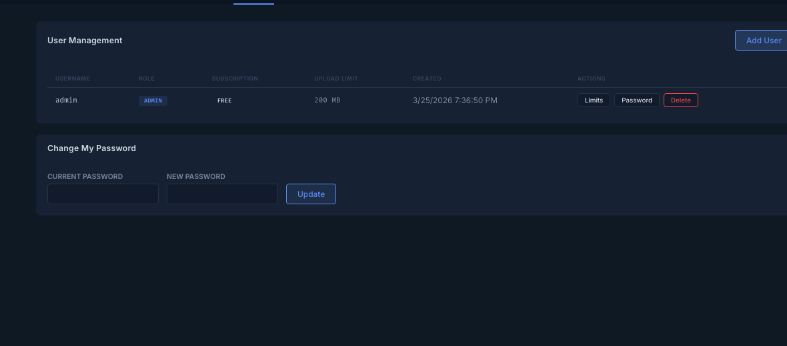

### 10. System health and monitoring

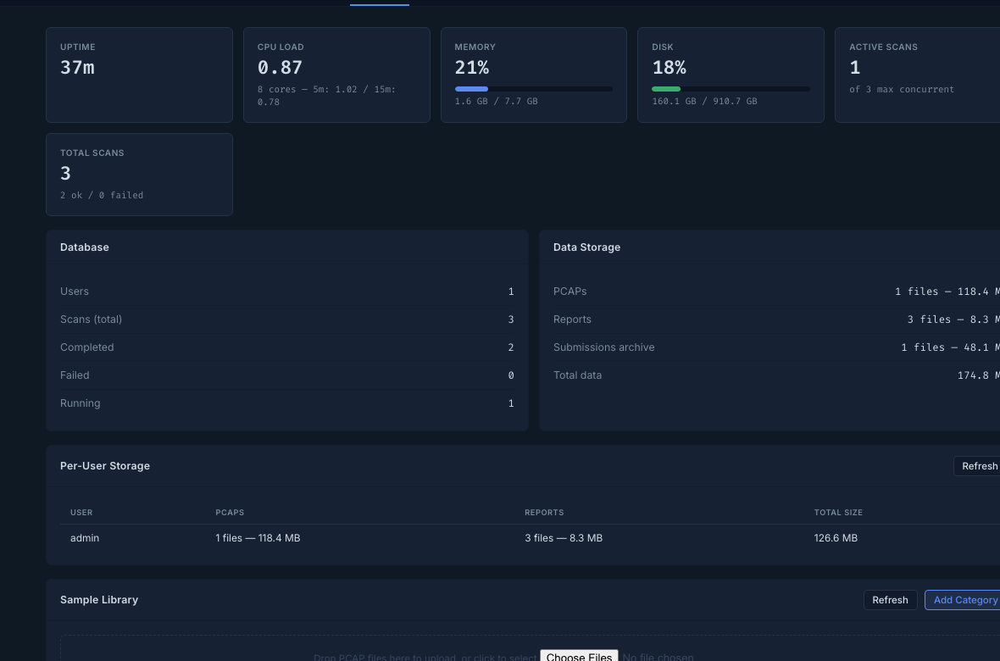

### 11. Report-to-report diff viewer

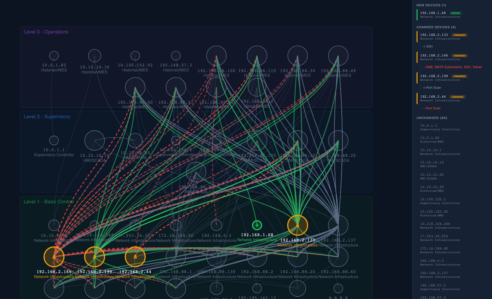

## Quick Start

1. Clone the repository and enter the project directory.

```bash
git clone https://github.com/riverrisk/marlinspike.git
cd marlinspike
```

2. Copy the example environment file and set strong secrets.

```bash
cp .env.example .env
```

3. Build and start the stack.

```bash
docker compose up -d --build
```

4. Open the app at `http://127.0.0.1:5001` or through your reverse proxy.

On first boot, MarlinSpike creates an admin user. If `ADMIN_PASSWORD` is empty, a random password is generated and printed to the container logs.

## Configuration

The main environment variables are:

- `DB_PASSWORD`: PostgreSQL password
- `SECRET_KEY`: Flask session secret
- `ADMIN_PASSWORD`: initial admin password
- `ENABLE_LIVE_CAPTURE`: set to `true` to expose local interface capture in the UI
- `PCAP_MAX_SIZE`: maximum accepted upload size in bytes
- `PCAP_PROCESS_SIZE`: processing cap for auto-sliced uploads in bytes

See [INSTALL.md](INSTALL.md) for a generic deployment walkthrough.

## Source Layout

The canonical application modules are:

- `_ms_engine.py`
- `_auth.py`
- `_models.py`
- `_config.py`
- `app.py`

The non-underscored modules (`auth.py`, `models.py`, `config.py`) are compatibility shims so older tooling can still import them without drifting from the real source.

## Sample Data

The public repository does not bundle third-party PCAP corpora. If you want a preset sample library, add captures under `presets/<category>/` locally or through the admin UI after deployment.

## Development

- `python3 -m py_compile app.py _auth.py _config.py _models.py _ms_engine.py`
- `docker compose up --build`

See [CONTRIBUTING.md](CONTRIBUTING.md) for contribution guidelines.

## Fathom

MarlinSpike is the open-source core of **Fathom**, the commercial OT security platform from [River Risk Partners](https://riverriskpartners.com).

Learn more at [riverriskpartners.com](https://riverriskpartners.com).

## License

This repository is licensed under the GNU Affero General Public License v3.0. See [LICENSE](LICENSE).
