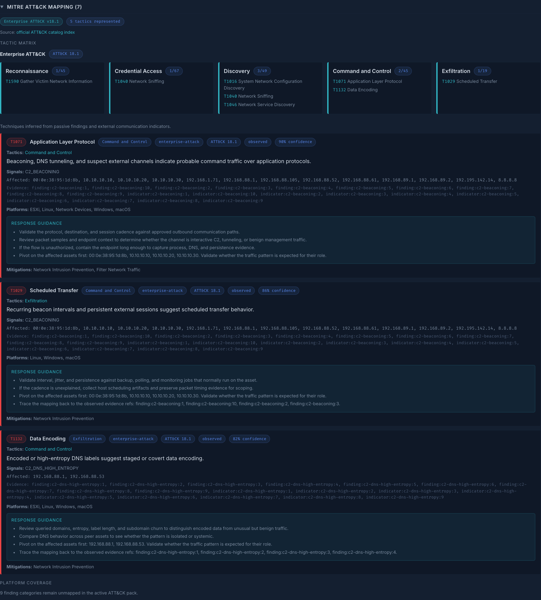
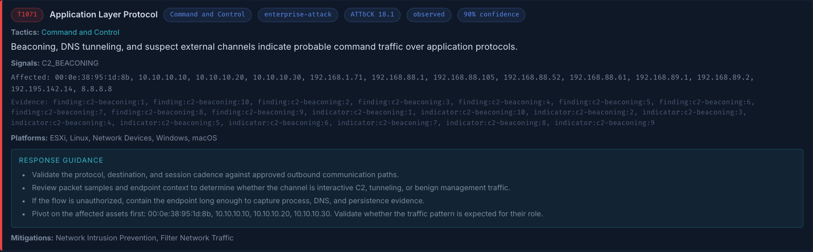
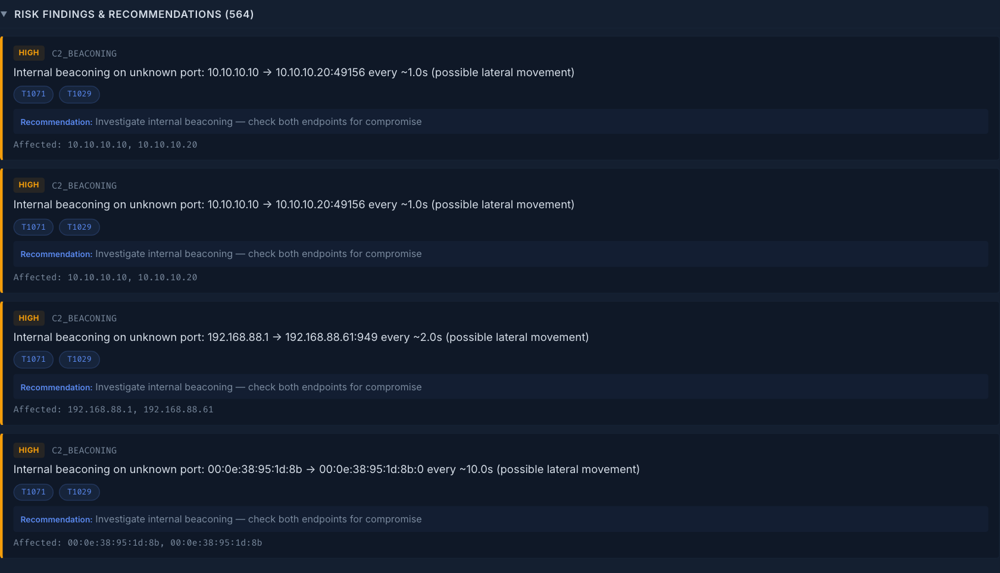

# MITRE ATT&CK Guide

This guide explains how MarlinSpike presents MITRE ATT&CK in the report viewer,
what each part means, and how to use it during field triage.

MarlinSpike's ATT&CK implementation is powered by the shared
`marlinspike-mitre` runtime and includes:

- ATT&CK domain and version metadata
- tactic-grouped matrix views
- techniques and sub-techniques
- parent-technique context
- mitigation references
- response guidance tied to the mapped behavior
- ATT&CK IDs backfilled onto related findings and indicators

The ATT&CK data is versioned inside the sidecar artifact, so each report can
tell you exactly which ATT&CK release the mapping came from.

## Start Here

Open a report and expand `MITRE ATT&CK Mapping` in the assessment drawer.

That section gives you four things right away:

1. ATT&CK version badges
2. a tactic matrix
3. mapped technique cards
4. platform coverage cards

If you only have 30 seconds, scan the matrix first, then open the highest
confidence technique cards.

## What The ATT&CK View Looks Like

The overview starts with ATT&CK version metadata, then a tactic matrix, then
full technique cards below it.

Use this screen to answer:

- which ATT&CK domain and version were used
- where activity is clustering in the ATT&CK lifecycle
- which techniques deserve analyst attention first

## How To Read The ATT&CK Section

### 1. Version Badges

The badges at the top tell you which ATT&CK catalog release produced the
mapping.

Examples:

- `Enterprise ATT&CK v18.1`
- `ATT&CK for ICS v18.1`

This matters when you compare reports over time, validate a mapping against a
specific ATT&CK release, or brief teams that need exact version provenance.

### 2. Tactic Matrix

The matrix groups mapped entries by ATT&CK tactic.

Each tactic card shows:

- the tactic name
- how many mapped entries landed in that tactic
- the specific techniques represented there

This is the fastest way to build a mental model of the report:

- concentrated `Command and Control` often points to beaconing or external channel review
- `Exfiltration` suggests data movement concerns
- `Discovery` clusters often tell you the report is showing environment reconnaissance or visibility context

Best practice:

1. scan the matrix for lifecycle concentration
2. identify the tactics that matter most
3. read the technique cards beneath it for evidence and next steps

### 3. Technique Cards

Each technique card represents a mapped ATT&CK technique or sub-technique.

The card can show:

- ATT&CK ID and title
- tactic labels
- ATT&CK domain and version
- basis and confidence
- parent technique for sub-techniques
- matched signals
- affected nodes
- evidence references
- mitigations
- response guidance

This is the part of the UI you use when you need to know what MarlinSpike
believes it saw, why it mapped that behavior, and what to do next.

The `Response Guidance` block is there for fast triage. It is meant to support
the analyst, not replace judgment.

### 4. Platform Coverage Cards

Platform coverage is not the same thing as a confirmed ATT&CK hit.

Coverage means MarlinSpike has passive-analysis visibility or workflow relevance
for a technique area. It does not mean adversary behavior was confirmed.

Treat platform coverage as:

- visibility context
- defensive review prompts
- matrix coverage indicators

Do not treat platform coverage cards as incident findings on their own.

## Basis: Observed vs Inferred vs Platform

The `basis` label is one of the most important cues in the ATT&CK view.

- `observed` means the mapping came from matched findings or indicators in the report
- `inferred` means the mapping is weaker and should drive investigation, not certainty
- `platform` means the entry reflects passive-analysis coverage or workflow context

If time is limited, triage in this order:

1. `observed`
2. `inferred`
3. `platform`

In practice:

- `observed` should get first-pass analyst attention
- `inferred` should drive validation and scoping
- `platform` should help you reason about visibility and detection posture

## ATT&CK Chips On Findings

MarlinSpike backfills ATT&CK IDs onto findings and C2 indicators when the MITRE
extension maps those signal categories.

That means a finding such as `C2_BEACONING` can carry technique IDs directly in
the finding card, so you can pivot between raw evidence and ATT&CK framing
without losing context.

This is especially useful during live triage because it keeps the workflow
connected:

- read the finding
- see the ATT&CK IDs immediately
- jump into the ATT&CK section for evidence, tactics, and guidance
- pivot back into affected assets and communications

## Sub-Techniques

If a mapped entry is a sub-technique, MarlinSpike shows the parent technique as
well.

Example:

- sub-technique: `T1055.011`
- parent technique: `T1055`

This helps you decide whether to report at the precise sub-technique level or
roll the behavior up to the broader parent technique for audience clarity.

## Recommended Analyst Flow

For fast field use, this is the strongest workflow:

1. Review critical and high findings first.
2. Expand `MITRE ATT&CK Mapping` and scan the matrix for lifecycle concentration.
3. Open the highest-confidence technique cards and read the response guidance.
4. Pivot into the affected assets and conversations to validate scope.
5. Use platform coverage cards to identify visibility gaps or passive-analysis context.

## What This Feature Is Best At

MarlinSpike's ATT&CK layer is especially useful for:

- framing suspicious passive evidence in ATT&CK language
- briefing responders and asset owners quickly
- showing leadership where activity clusters in the ATT&CK lifecycle
- comparing ATT&CK coverage between reports
- deciding whether a report is primarily reconnaissance, command and control, or exfiltration oriented

## Honest Boundaries

MarlinSpike's ATT&CK implementation is intentionally grounded in passive network
evidence and report-facing enrichment.

It is not:

- an active scanner
- an endpoint detection product
- a complete ATT&CK analytics platform for every technique
- a guarantee that a mapped technique is malicious without analyst review

The value is high-signal ATT&CK framing for passive OT and ICS triage.

## Related Files

- shared plugin repo: [`/Users/butterbones/marlinspike-mitre`](/Users/butterbones/marlinspike-mitre)
- vendored runtime: [`plugins/marlinspike_mitre/`](/Users/butterbones/riverflow/marlinspike/plugins/marlinspike_mitre)
- vendored rule pack: [`rules/mitre/base.yaml`](/Users/butterbones/riverflow/marlinspike/rules/mitre/base.yaml)
- screenshot capture helper: [`scripts/capture_mitre_screenshots.py`](/Users/butterbones/riverflow/marlinspike/scripts/capture_mitre_screenshots.py)
- MITRE sync helper: [`scripts/sync-mitre-bootstrap.sh`](/Users/butterbones/riverflow/marlinspike/scripts/sync-mitre-bootstrap.sh)
